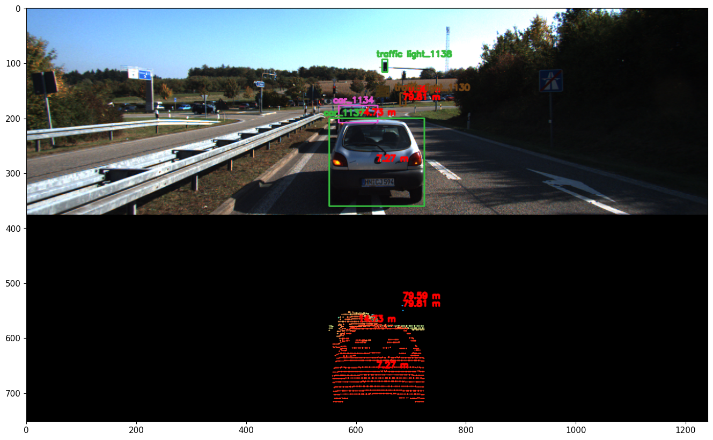

# 3D Object Tracking using LiDAR, Camera, and IMU on KITTI Dataset

## Introduction
This project implements a robust 3D object tracking pipeline by fusing data from LiDAR, RGB camera, and IMU sensors. 
It uses a Kalman Filter and Hungarian algorithm for tracking, integrating sensor calibration and timestamp alignment 
for accurate multi-object tracking.

## Dataset
- KITTI Raw Dataset: http://www.cvlibs.net/datasets/kitti/raw_data.php
- Drive used: 2011_10_03_drive_0047_sync

## Features
- Processes KITTI dataset including images, LiDAR, and IMU data
- Calibrates and aligns multi-sensor data
- Detects objects (via bounding boxes or detection model)
- Tracks objects using:
  - Kalman Filter for state prediction and update
  - Hungarian Algorithm for data association
- Visualizes tracked objects frame-by-frame

## Results

s
